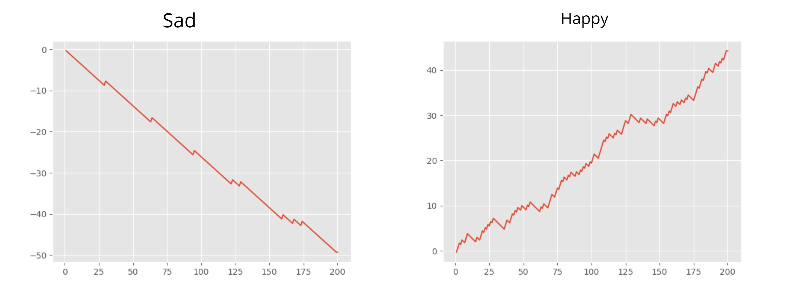
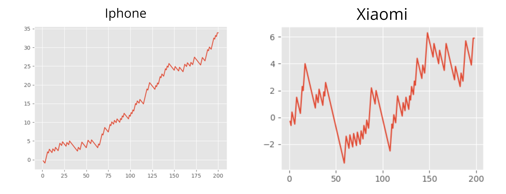

# Brand analysis using tweets

## What is the project?
This is a project to predict the sentiment of tweets using Recurrent Neural Networks and Twitter API for python call Tweepy.

## How it works?
* Collecting the **dataset**
* Convert the text to the **same case**, **Remove reddundant symbols and text** like @ and RT
* **Tokenize** all the tweets and pad to a common length
* Build the **model** and pass in the inputs
* Use **Tweepy** and create a connection with twitter
* Get user input for topic and perform analysis for all the **live tweets** 
* Create a **graph** based on the Sentiment of tweets
## Sample prediction

